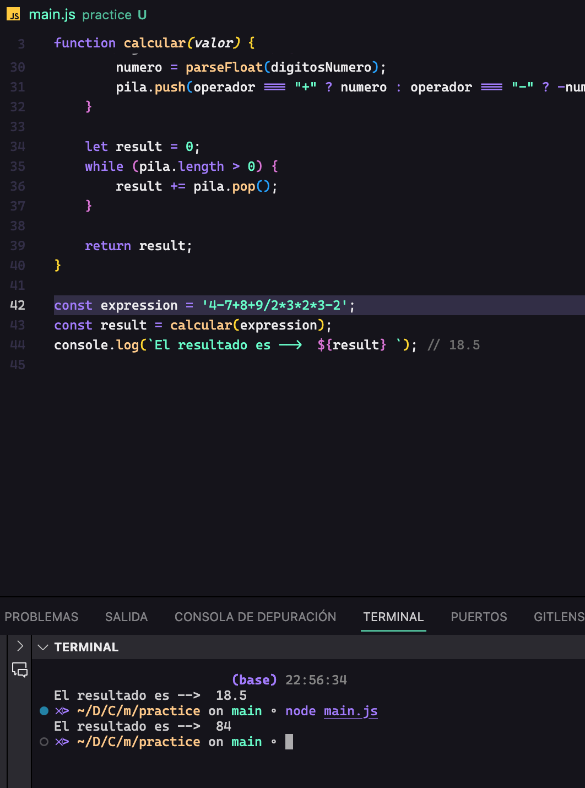
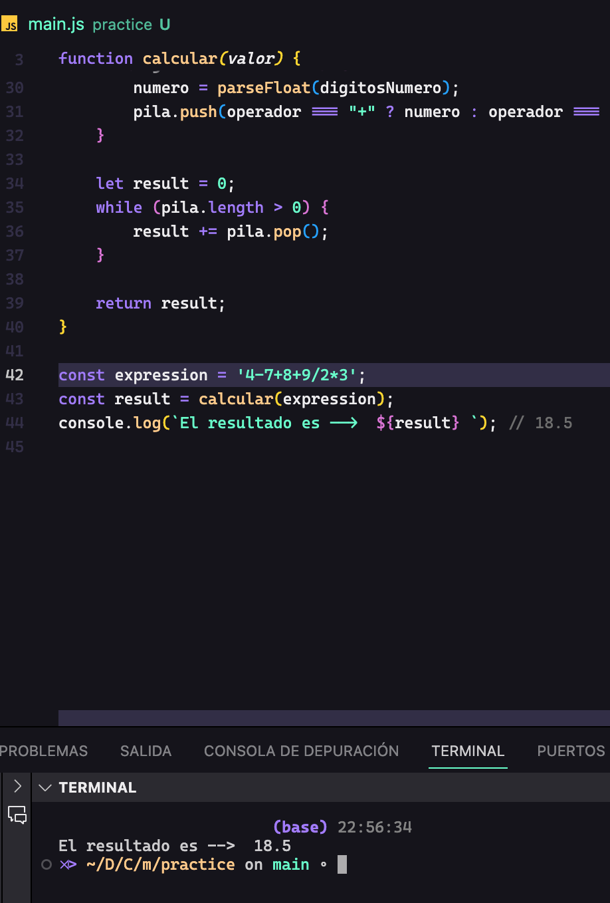

3. Ejercicio de Lógica

Para desarrollar la solucion respecto al siguiente ejercicio, tenemos como entrada una cadena de caracteres, mismos que deben operarse los digitos que contiene, conforme a los operadores que lo acompañen, analizando diversas formas para poder solucionar y volver funcional las operaciones; se encontró un algoritmo que ayuda a evaluar las expresiones matemáticas.

RPN( Notación Polaca Inversa), este método nos permite evaluar una expresion matemática y de esta manera calasificar los numero y operadores.

Pasos:
- se empieza declarando e inicializando las variables de la función llamada CALCULAR:

    let numero = 0;
    let digitosNumero = "";
    let operador = "+";
    let pila = [];

- se procede con el Recorrido de la expresion, esto mediante un ciclo 'for', este va iterando toda la cadena
    se itera sobre cada caracter de la expresión.
    si el caracter es un dígito o un punto decimal, se agrega al número actual.
    Si el carácter es un operador (+, -, *, /):
        Se convierte el número actual a un número flotante y se coloca en la pila según el operador anterior.
        Se actualiza el operador actual con el nuevo operador.
        Se reinicia el número actual.

- Finalización del bucle:
    Después de recorrer toda la expresión, se agrega el último número a la pila.
    Se realiza una operación final de acuerdo al último operador encontrado.

- Suma de los elementos en la pila:
    Se suman todos los elementos en la pila para obtener el resultado final.

-       CAPTURAS DE PANTALLA FUNCIONAMIENTO

