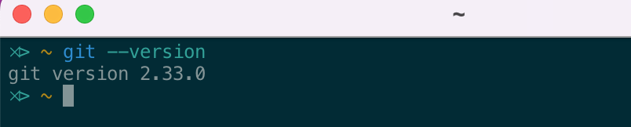
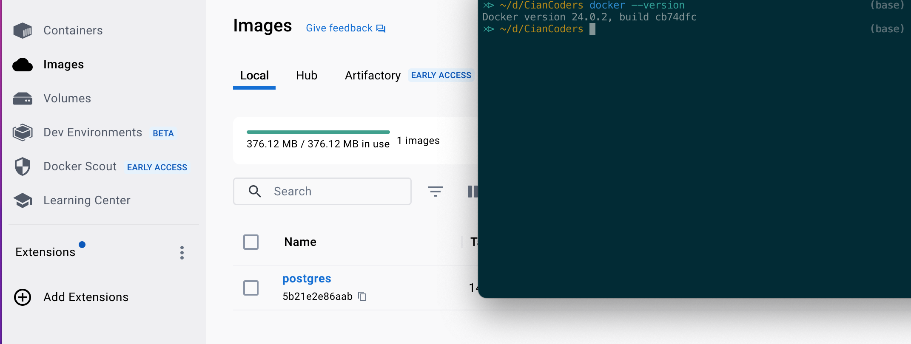
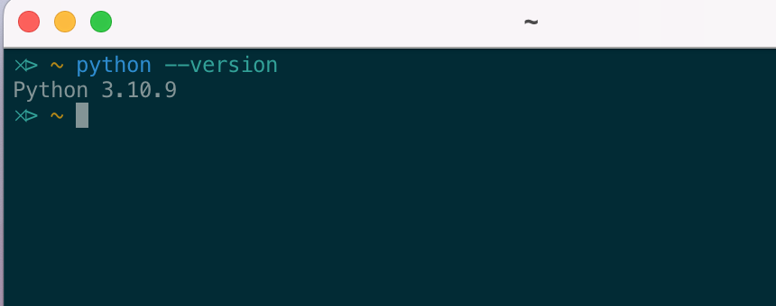
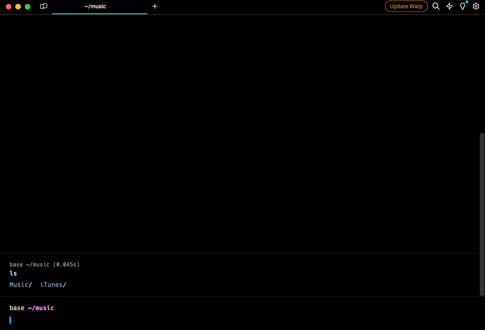
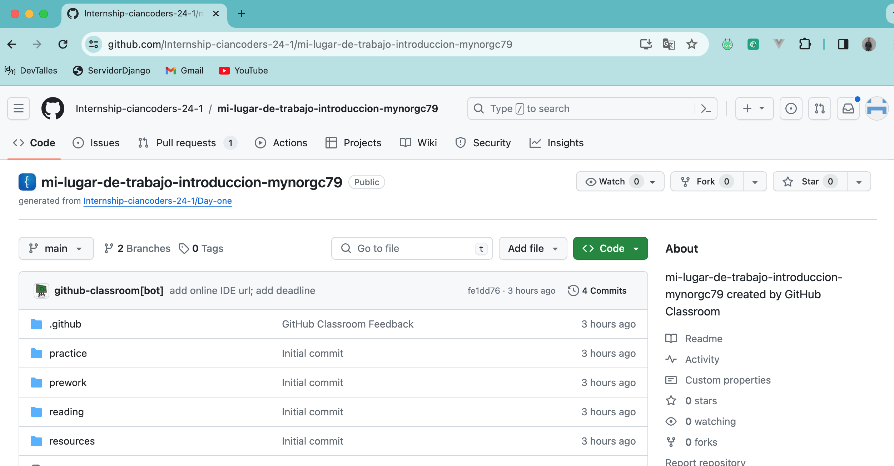

Configuración del entorno de trabajo.

1.    git

2.  editor de código (libre)

3.  Docker

4.  nvm (node), yarn, vite

5.  Interprete de python

6.  terminal

7.  Instalacion de navegador y Plugins

    otros:
- crear una cuenta de github.
        
      
